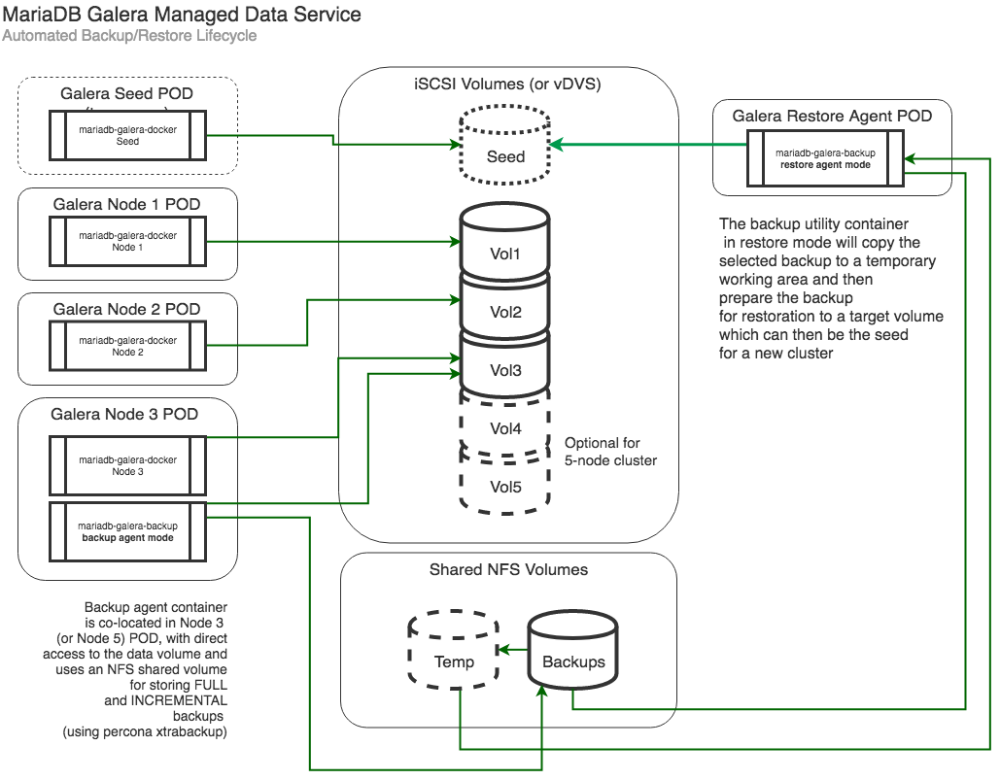
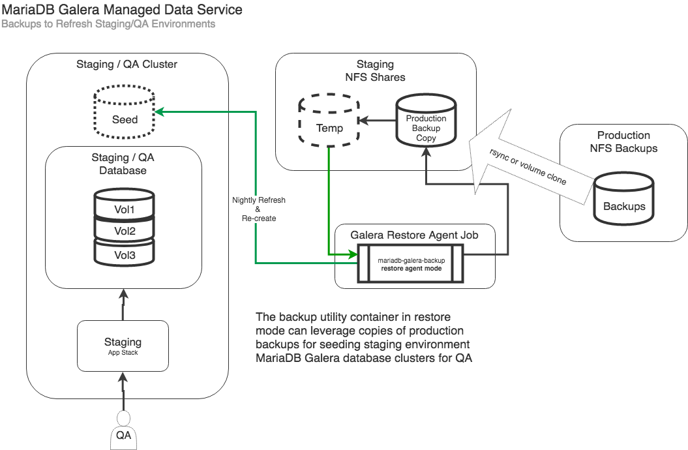
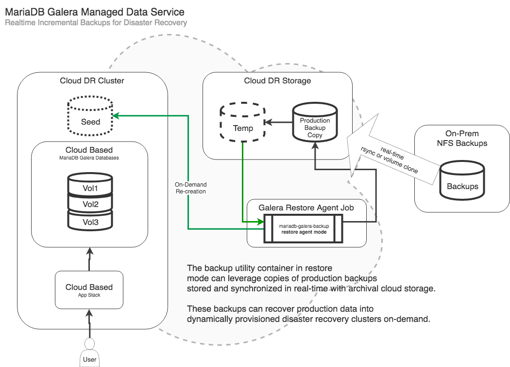

MariaDB Galera on Kubernetes
============================

This implementation has been tested in two variants:

* Using iSCSI direct volumes and NFS shares in CoreOS Tectonic with Nodeport external access.
* Using vSphere storage volumes and NFS shares in VMware PKS with dedicated external LB access.

There is also the option to enable an automated backup agent as a sidecar container, which uses an NFS share to store the backups.

With the __backup agent__ enabled, it also requires an __NFS__ volume for the backup storage.

[AWS Storage Gateway](https://aws.amazon.com/storagegateway/) is a great way to deliver iSCSI and NFS storage into an ESXi environment with auto-replication to AWS storage services and management through the AWS console.  It's pretty awesome.

## Ansible Template Approach

It uses ansible templates to generate a __MariaDB Galera__ yaml manifests based on configuration information supplied via an ansible inventory file.

The templates generate two sets of configuration files:

* 3-node
* 5-node

In the __clusters__ folder create a sub-folder that matches the name of the prefix for the galera cluster name (see the examples in the __coreos-example__ and __pks-example__ folders respectively), and copy the relevant __***-example__ folder and rename it.

Add or adjust the ansible configuration file with the specifics to your environment, see the __galera.conf__ file in respective example folder.

Run the ansible playbook to generate the Kubernetes YAML deployment manifests:

    $ ansible-playbook -i clusters/my-cluster/galera.conf mariadb-galera-template.yml

This will create a set of output manifest files in the __my-cluster__ folder that can then be deployed to Kubernetes.  Select either the 3 or 5 node deployment scripts depending on the size of the cluster to deploy:

There is also two variants of deployment:

* __Without__ Integrated Backup Agent
* __With__ Integrated NFS Backup Agent

## VMware PKS

For VMware PKS it is important to make sure you have defined the storage class as it uses the vSphere volume storage driver for docker for the persistent volumes.  The examples use the __vmware-thin__ storage class (available in the __etc__ folder), but this can be adjusted in the configuration file.

__Important__ that the VMware storage driver is __NOT__ marked as default as it doesn't handle NFS and iSCSI intrinsic volumes properly.  Run the following command to __unset__ the vSphere storage driver as the default:

        kubectl patch storageclass vmware-thin -p '{"metadata": {"annotations":{"storageclass.kubernetes.io/is-default-class":"false"}}}'

> This has been tested and developed on a __VMware Pivotal PKS__ cluster.  For details on configuring an NSX-T/PKS home lab [see this guide](https://github.com/ids/the-noobs-guide-to-nsxt-pks).

### VMware PKS Configuration File Example

The following is an example VMware PKS __galera.conf__ file:

    [all:vars]
    galera_cluster_name=pks
    galera_cluster_namespace=web
    galera_cluster_docker_image=idstudios/mariadb-galera:10.3
    galera_cluster_haproxy_docker_image=idstudios/mariadb-galera-haproxy:latest
    galera_cluster_backup_agent_image=idstudios/xtrabackup-agent:latest

    galera_target_datastore=san
    galera_vsphere_storage_class=vmware-thin

    galera_cluster_volume_size=10Gi
    galera_cluster_backup_volume_size=10Gi
    galera_cluster_backup_nfs_server=192.168.1.107
    galera_cluster_backup_path="/idstudios-files-galera-backups"
    galera_cluster_backup_retention_days=3
    galera_cluster_backup_incremental_interval="60m"

    galera_xtrabackup_password=Fender2000
    galera_mysql_user=drupal
    galera_mysql_password=Fender2000
    galera_mysql_root_password=Fender2000
    galera_mysql_database=drupaldb
    galera_cluster_backup_user=root

    [template_target]
    localhost

## CoreOS Tectonic

> Make sure to clear out the iSCSI volumes between cluster creations.  If there is existing galera data on the volumes the clusters will try to recover instead of forming new nodes. See [Purge Seed and Node Data Volumes](#purge-seed-and-node-data-volumes) on how to do this.

> This has been tested and developed on the __Tectonic CoreOS__ cluster from [cluster-builder](https://github.com/ids/cluster-builder).  It requires you have a working [kubectl configuration](https://coreos.com/tectonic/docs/latest/tutorials/aws/first-app.html#configuring-credentials) already in place.

This configuration uses iSCSI direct access for the persistent data volumes.  It requires access to an iSCSI target that contains at least 4 luns: 1 for the initial seed volume which will be discarded, and 3 or 5 nodes for the permanent node volumes.

### CoreOS Configuration File Example

    [all:vars]
    galera_cluster_name=tier1
    galera_cluster_namespace=web
    galera_cluster_docker_image=idstudios/mariadb-galera:10.3
    galera_cluster_haproxy_docker_image=idstudios/mariadb-galera-haproxy:latest
    galera_cluster_backup_agent_image=idstudios/mariadb-galera-backup:latest
    galera_cluster_nodeport=30306

    galera_cluster_seed_iscsi_targetportal="192.168.100.40:3260"
    galera_cluster_seed_iscsi_iqn="iqn.2018-04.io.idstudios:server.target0"
    galera_cluster_seed_iscsi_lun=1

    galera_cluster_volume_size=50Gi
    galera_cluster_backup_volume_size=50Gi
    galera_cluster_backup_log_volume_size=50Gi
    galera_cluster_backup_nfs_server=192.168.100.40
    galera_cluster_backup_path="/data/shared/backups"
    galera_cluster_backup_retention_days=7

    galera_cluster_node1_iscsi_targetportal="192.168.100.40:3260"
    galera_cluster_node1_iscsi_iqn="iqn.2018-04.io.idstudios:server.galera"
    galera_cluster_node1_iscsi_lun=1

    galera_cluster_node2_iscsi_targetportal="192.168.100.40:3260"
    galera_cluster_node2_iscsi_iqn="iqn.2018-04.io.idstudios:server.galera"
    galera_cluster_node2_iscsi_lun=2

    galera_cluster_node3_iscsi_targetportal="192.168.100.40:3260"
    galera_cluster_node3_iscsi_iqn="iqn.2018-04.io.idstudios:server.galera"
    galera_cluster_node3_iscsi_lun=3

    galera_xtrabackup_password=Fender2000
    galera_mysql_user=drupal
    galera_mysql_password=Fender2000
    galera_mysql_root_password=Fender2000
    galera_mysql_database=drupaldb

    galera_cluster_backup_user=root

    [template_target]
    localhost

### 3 or 5 Node Galera

> In the examples below simply replace 3 with 5 in the manifest names if you wish to deploy a 5 node cluster.

#### Step 0 - Namespace

If the namespace is other then __default__ and does not already exist:

    kubectl apply -f galera-3-namespace.yml

#### Step 1 - Setup Persistent Volumes

From within the 3-node galera cluster folder, apply the configurations in order:

##### PKS

    kubectl apply -f galera-3-vsphere-volumes.yml

##### CoreOS

    kubectl apply -f galera-3-volumes.yml

This will setup the persistent volumes for the galera nodes.

#### Step 2 - Launch the Seed Instance

    kubectl apply -f galera-3-seed.yml

This will bring up the seed instance of mysql... wait until it starts and is ready with mysql accepting connections before moving on to the nodes.

#### Step 3 - Launch the Permanent Galera Nodes

If you wish to deploy without a backup agent, use:

    kubectl apply -f galera-3-nodes.yml

Or, with a backup agent:

    kubectl apply -f galera-3-nodes-backup.yml

The nodes should come up fairly quickly.  Once they are all up and ready, start the HAProxy:

#### Step 4 - Start the Database HAProxy

This load balances all communication with the database equally over the nodes in the galera cluster:

    kubectl apply -f galera-3-haproxy.yml

#### Step 5 - Decomission the Seed Node

Delete the seed node:

    kubectl delete -f galera-3-seed.yml

Which should leave a __3__ or __5__ node cluster fronted by HAProxy.

`kubectl exec` into any of the nodes and verify the cluster:

    mysql -u mariadb-galera-haproxy -u root -p
    > show status like '%wsrep%';

It should show the 3 or 5 node cluster configuration information.

You can then enable and disable external access to the cluster (for data loading):

#### Enable/Disable External Access

##### PKS

    kubectl apply -f galera-external-lb.yml

> This dedicates an NSX-T load balancer to galera and exposes 3306 on it.

    mysql -h <address of nsx-t lb> -u root -p

##### CoreOS

    kubectl apply -f galera-external-access.yml

> This opens the specified __NodePort__ from the configuration and accepts connections.

    mysql -h <address of worker node> --port <node port specified> -u root -p

Will give you access to the running galera cluster through the HAProxy.

    kubectl delete -f galera-external-access.yml/galera-external-lb.yml

Will close off external access.

## Automated Backup / Restore

The __Kubernetes__ verion of __mariadb-galera-docker__ enables the integration of an automated backup and restore agent.

Each Galera instance will bundle a __mariadb-galera-backup__ agent with the last node in the cluster.  It is co-located in the POD with the database engine, and performs periodic backups to a configured NFS share (made available as a persistent volume).

The backup agent will perform periodic compressed backups at a configured interval.  These backups can then be __restored__ into Staging / QA environments:

In support of the final stage of a QA process, or as part of a __Disaster Recovery__ strategy:

Leveraging real-time replicated __Cloud Storage__ backups and a __Hybrid Cloud__ infrastructure, production environments dependent on __mariadb-galera-docker__ can be recreated on demand with backups current to the __defined incremental interval__ before failure.

The __mariadb-galera-backup__ container, in __restore__ mode, will copy a target backup to a temporary working folder (so as to be non-destructive to the original backup), and then restore it to the latest incremental backup in the series.

> __Note__ that the current implementation always chooses the most recent backup.  Future iterations will include the ability to specify point in time incremental restore.

To perform a restore, ensure that the restore job manifest maps to the correct volumes:

    apiVersion: batch/v1
    kind: Job
    metadata:
    name: tier1-galera-restore-job
    spec:
    template:
        spec:
        volumes:
        - name: <cluster name>-galera-backup-volume
            persistentVolumeClaim:
            claimName: <cluster name>-galera-backup-volume-claim
        - name: <cluster name>-galera-backup-temp-volume
            persistentVolumeClaim:
            claimName: <cluster name>-galera-backup-temp-volume-claim
        - name: <cluster name>-galera-seed-volume
            persistentVolumeClaim:
            claimName: <cluster name>-galera-seed-volume-claim
        
        containers:
        - name: <cluster name>-galera-backup-agent
            image: idstudios/mariadb-galera-backup:latest
            args: ["restore"]
            env:
            - name: SOURCE_BACKUP
            value: "latest"
            - name: SOURCE_INCREMENT
            value: "latest"
            
            volumeMounts:
            - name: <cluster name>-galera-backup-volume
                mountPath: "/backups"
            - name: <cluster name>-galera-backup-temp-volume
                mountPath: "/temp"
            - name: <cluster name>-galera-seed-volume
                mountPath: "/target"
        restartPolicy: Never
    backoffLimit: 4

__(cluster name)-galera-backup-volume__ must point to the root NFS volume that contains the backups.

__(cluster name)-galera-backup-temp-volume__ must point to an NFS volume that contains enough space to hold the fully uncompressed backups.

__(cluster name)-galera-seed-volume__ should point to the target seed volume that will be the seed for the newly created galera cluster.

> The __idstudios/mariadb-galera-backup:latest__ is not tied to the original cluster for __restore__, and only requires a copy of the backups.  It can even be used against non-galera MariaDB and MySQL database backups.

#### Purge Seed and Node Data Volumes (CoreOS Only)

The current implementation uses native Kubernetes iSCSI integration for the underlying data volumes, and NFS for the backup and scratch storage.

The iSCSI volumes are not easily accessed directly, so the template scripts produce a utility job for wiping these underlying iSCSI data volumes clean - which can be handy in development.

> Please use with caution

    kubectl apply -f galera-3-purge-volumes-job.yml

> This requires that the volumes have already been created with:

    kubectl apply -f galera-3-volumes.yml

## MariaDB Galera Helm Chart

https://docs.helm.sh/

Coming Soon.
